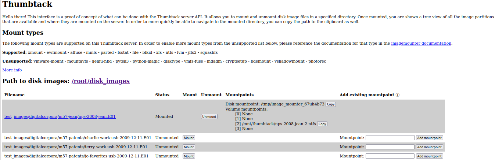

.. _web-interface:

Web Interface
=============

Main Thumbtack UI
-----------------

This is the main page of the web interface.
It shows the mounted status of disk images in the directory that the Thumbtack server is configured to show.
Once an image is mounted, a tree view is shown of the partitions in the disk image and where they are mounted.

Mounted Disk Image Info
-----------------------

This is the view that can be seen at http://127.0.0.1:8208/mounts.
It returns a JSON object of information about the disk image and all of its partitions.

.. image:: img/mounted_disk_images.png
    :scale: 60%

Supported Mount Types
---------------------

This shows the supported mount types that the Thumbtack server supports.
In order to support more mount filetypes, follow the instructions in the `imagemounter documentation`_

.. image:: img/supported_mount_types.png
    :scale: 60%

.. _imagemounter documentation: https://imagemounter.readthedocs.io/en/latest/specifics.html
